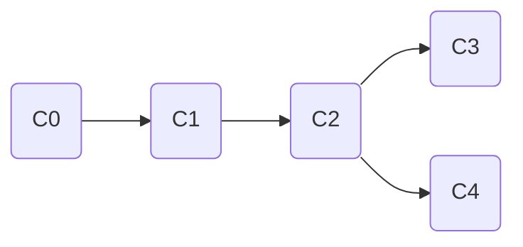
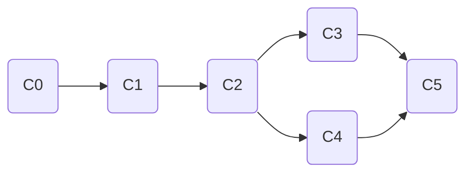

**git处理分支的方式十分轻量，因此鼓励在工作流程中频繁地使用分支与合并**。

### git保存数据的方式

在提交操作时，git计算每个子目录的校验和，将其保存为**树对象**。然后创建一个**提交对象（commit object）**，保存了指向树对象的指针、作者信息、提交信息、指向父对象的指针。**文件快照保存为blob对象，树对象记录目录结构和blob对象索引，提交对象记录指向树对象的指针和提交信息**。

**git分支**，是指向提交对象的可变指针，本质上只是包含所指对象校验和的文件。默认分支名为`master`，在每次提交操作中向前移动。`HEAD`是一个特殊的指针，指向当前所在的本地分支。

**此部分阅读《git权威指南》更好**。

### 分支操作常用命令

```bash
git branch # 展示分支
git branch -v # 显示分支最后一次提交
git branch "xxx" # 创建分支
git checkout "xxx" # 切换分支，切换HEAD的指向
git checkout -b "xxx" # 创建分支并切换
git log --oneline --decorate --graph --all # 查看分支对应的对象
git merge "xxx" # 合并分支
git branch -d "xxx" # 删除分支，如果未合并报错，合并或者强制删除

git branch --merged # 查看已经合并到当前分支的分支
git branch --no-merged
```

分支切换会改变工作目录中的文件。

合并分支时可能面临的情况如下：

**快进（`fast-forward`）**。指在合并分支时，顺着一个分支可以到达另一个分支，在合并时只需要简单的将指针向前推进，没有需要解决的分歧。即一个分支是另一个分支的直接上游。

**合并提交**。开发历史从更早的地方分叉，某个分支并不是另一个分支的直接祖先，在合并时git会使用两个分支的末端快照和最优共同祖先（git自行决定）进行三方合并，合并结果作为一个新的快照并自动创建一个新的提交，即合并提交。该提交有多个父提交。

**手动解决冲突**。在两个不同分支修改了同一个文件的同一个部分，则git无法自动合并。git合并后并不自动产生合并提交，需要手动解决冲突文件。

### 分支工作流的例子

**一个用git分支进行开发的案例，具体如下**：
- 当前处于版本库的master分支。
- 计划解决问题追踪系统中的#53问题。基于master分支创建iss53分支，并进行开发、更新。
- 接到紧急任务，有个紧急问题需要解决。切换回master分支，基于master分支建立hotfix分支，解决问题。
- 解决紧急问题后，将hotfix分支合并到master分支，并部署到线上。删除hotfix分支。
- 切换回iss53分支。可以将master分支合并到iss53分支（获取更新），也可以继续开发，之后将iss53分支合并到master分支。

### 分支开发工作流的模式

介绍常见的分支开发工作模式。

**长期分支**。在整个项目的开发周期，可以同时拥有多个开放分支，定期地将某些分支合并到其他分支中。例如以下具有不同稳定性的分支：

```yaml
- master # 完全稳定的代码
- develop/next # 开发或者测试稳定性，达到稳定则合并到master
- proposed/updates # 包含不成熟的想法，无法进入next分支
```

**特性分支**。短期分支，用来实现单一特性或者工作，适用于任何规模的项目。

**更多内容参考分布式git**。

### 远程分支

**远程引用是对远程仓库的引用，包括分支和标签**。

**远程跟踪分支**。对远程分支状态的引用，是不能移动的本地引用，以`remote/branch`命名。

**跟踪分支**。与远程分支直接关系的本地分支，在跟踪分支上`git pull`可以自动获取并合并更新。一般从远程分支检出本地分支时会自动创建跟踪分支。

**抓取到新的远程分支，本地并不会自动生成可编辑的副本。可以将新分支合并到当前分支，也可以基于远程分支建立新的分支**。

**拉取**。`git fetch`从服务器抓取数据，但是不自动合并。在跟踪分支上`git pull`自动获取数据并合并。

**推送**。本地分支不会自动与远程仓库同步，公开分享一个分支，必须显示推送`git push <remote> <branch>`。将branch名字展开成`refs/heads/<branch>:refs/heads/<branch>`。

**删除远程分支**。`git push origin --delete <branch>`。删除远程分支，保留数据直到垃圾回收。

```bash
# 跟踪分支
git checkout -b <branch> <origin>/<branch>
git checkout --track <origin>/<branch> # 简写
git branch -u <origin>/<branch> # 修改跟踪的远程分支
git branch -vv # 查看所有跟踪分支

# 推送
git push origin serverfix # 本地serverfix推送到远程serverfix
git push origin serverfix:awesomebranch # 本地serverfix推送到远程awesomebranch
```

### 变基

在git中，有两种方式来合并不同分支的修改：
- `merge`。基于两个分支的最新快照和共同祖先进行三方合并，生成新提交。
- `rebase`。将提交到某一个分支上的所有修改转移到另一个分支。原理为：首先找到两个分支的共同祖先，然后比较祖先和当前分支的历次提交，寸为临时文件，将当前分支指向目标分支，依次应用历次修改（临时文件）。变基的修改也可以用于其他的分支。

例如以下提交历史：



C3为master分支，C4为experiment分支。使用合并将产生以下提交历史：



如果使用rebase，则命令如下：

```bash
git checkout experiment
git rebase master
# git rebase master experiment
git checkout master
git merge experiment
```

产生的提交历史为：

```mermaid
graph LR
    C0(C0) --> C1(C1) --> C2(C2) --> C3(C3) --> C4'(C4')
    C2 -->|不再存在| C4(-C4-)
```

**变基实质上丢弃了一些现有提交，然后创建新的提交（内容一致）。一般是为了确保在向远程仓库推送时保持提交历史的整洁。但是不要对在仓库外有副本的分支执行变基，即已经共享的分支不要执行变基**。

使用合并还是变基，取决于用户是将提交历史用作记录实际发生了什么，还是将提交历史看作项目过程中发生的事情，反复修订便于方便使用。

### 参考

《精通git第二版》
